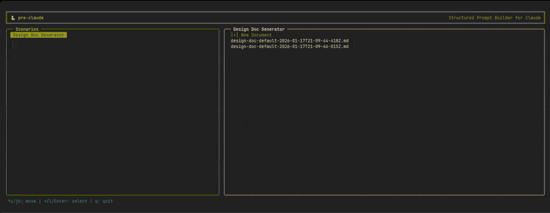
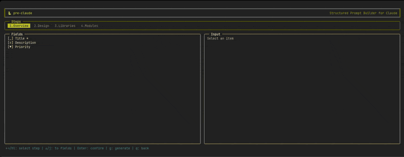
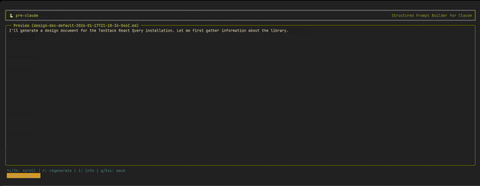

# pre-claude

「pre」-claude は複雑なプロンプトをフォームで効率的に作成できる Claude Code 向け TUI ツールです。

TypeScript 設定ファイルで定義したテンプレートをチームで共有し、再現性のあるプロンプト運用を実現できます。

MCP や Skills など既存の Claude Code セットアップをそのまま利用できます。

## 概念

### シナリオ

ドキュメントの種類（設計書、議事録など）を定義します。プロンプトテンプレートと出力先を設定できます。

### ステップ

フォームウィザードの各ページです。関連するフィールドをグループ化して入力しやすくします。

| シナリオ選択 | フォーム入力 | プレビュー |
|:---:|:---:|:---:|
|  |  |  |

## 必要条件

- Node.js 18+
- Claude Code

## インストール

```bash
npm install pre-claude
```

## 使い方

```bash
# サンプルを試す
npx pre-claude example
npx pre-claude example --lang ja

# 設定ファイルを作成
npx pre-claude init

# TUI を起動
npx pre-claude run --config ./pre-claude.config.ts
```

## 画面

TUI は 3 つの画面で構成されています。

### シナリオ選択画面

起動時に表示される 2 ペイン画面です。左ペインでシナリオを選び、右ペインで新規作成または既存ドキュメントの編集を選択します。


| キー | 動作 |
|------|------|
| `↑↓` / `j/k` | 項目移動 |
| `→` / `l` / `Enter` | 選択 / 右ペインへ |
| `←` / `h` / `Esc` | 左ペインへ |
| `q` | 終了 |

### フォーム入力画面

上部にステップタブ、左側にフィールド一覧、右側に編集エリアの 3 パネル構成です。


| キー | 動作 |
|------|------|
| `←→` / `h/l` | ステップ移動 |
| `↑↓` / `j/k` | フィールド移動 |
| `Enter` | 編集開始 / 確定 |
| `Esc` | キャンセル |
| `n` / `p` | 次 / 前のステップ |
| `d` | 繰り返し項目の削除 |
| `g` | プレビュー生成 |
| `q` | 戻る |

### プレビュー画面

AI がドキュメントを生成し、結果をストリーミング表示します。


| キー | 動作 |
|------|------|
| `↑↓` / `j/k` | スクロール |
| `r` | 再生成 |
| `s` | 保存 |
| `c` | Claude Code で続行 |
| `i` | formData / aiContext 表示 |
| `Esc` / `q` | 戻る |

`c` を押すと Claude Code のセッションを引き継いで対話を続行できます。

## 設定ファイル

### 基本構造

```typescript
import { defineConfig, defineScenario, type Step } from 'pre-claude';

const steps = [
  {
    slug: 'overview',
    title: '概要',
    description: 'プロジェクト基本情報',
    name: 'overview',
    fields: [
      {
        id: 'title',
        type: 'input',
        label: 'タイトル',
        description: 'プロジェクト名',
        required: true,
      },
    ],
  },
] as const satisfies Step[];

export default defineConfig({
  scenarios: [
    defineScenario({
      id: 'design-doc',
      name: '設計ドキュメント',
      steps,
      prompt: ({ formData, aiContext }) =>
        `以下に基づき設計ドキュメントを作成:\n${JSON.stringify({ formData, aiContext }, null, 2)}`,
      outputDir: './docs',
    }),
  ],
});
```

### シナリオ

| プロパティ | 型 | 必須 | 説明 |
|----------|------|:----:|------|
| `id` | `string` | ○ | 一意識別子 |
| `name` | `string` | ○ | 表示名 |
| `steps` | `Step[]` | ○ | フォームステップ |
| `prompt` | `(params) => string` | ○ | プロンプト生成関数 |
| `outputDir` | `string` | | 出力ディレクトリ |
| `filename` | `string \| function` | | ファイル名 |

`prompt` 関数は以下の引数を受け取ります。実際の値はプレビュー画面で `i` キーを押すと確認できます。

#### formData

フォームに入力された値がオブジェクトとして格納されます。

```typescript
{
  [stepName: string]: {
    [fieldId: string]: string | boolean | Array<{ [fieldId: string]: string | boolean }>
  }
}
```

例:

```json
{
  "overview": {
    "title": "My Project",
    "priority": "high"
  },
  "features": {
    "items": [
      { "name": "Feature 1", "desc": "Description 1" },
      { "name": "Feature 2", "desc": "Description 2" }
    ]
  }
}
```

#### aiContext

フィールドのラベルや説明などのメタ情報です。AI がフィールドの意味を理解するために使用します。

```typescript
{
  [stepName: string]: {
    _step: { title: string; description: string };
    [fieldId: string]: { label: string; description: string }
  }
}
```

例:

```json
{
  "overview": {
    "_step": { "title": "概要", "description": "プロジェクト基本情報" },
    "title": { "label": "タイトル", "description": "プロジェクト名" },
    "priority": { "label": "優先度", "description": "優先度を選択" }
  }
}
```

### ステップ

| プロパティ | 型 | 説明 |
|----------|------|------|
| `slug` | `string` | URL フレンドリーな識別子 |
| `title` | `string` | タイトル |
| `description` | `string` | 説明文 |
| `name` | `string` | formData のキー名 |
| `fields` | `Field[]` | フィールド配列 |

### フィールドタイプ

#### input

```typescript
{
  id: 'title',
  type: 'input',
  label: 'タイトル',
  description: '説明',
  placeholder: 'プレースホルダー',
  required: true,
  inputType: 'text', // 'text' | 'date' | 'url'
  suggestions: ['候補1', '候補2'], // オートコンプリート
  default: 'デフォルト値',
}
```

#### textarea

```typescript
{
  id: 'description',
  type: 'textarea',
  label: '説明',
  description: '詳細説明',
  rows: 5,
}
```

#### select

```typescript
{
  id: 'priority',
  type: 'select',
  label: '優先度',
  description: '優先度を選択',
  options: [
    { value: 'low', label: '低' },
    { value: 'medium', label: '中' },
    { value: 'high', label: '高' },
  ],
  default: 'medium',
}
```

#### checkbox

```typescript
{
  id: 'agree',
  type: 'checkbox',
  label: '同意する',
  description: '利用規約への同意',
  required: true,
}
```

### レイアウト

#### repeatable

動的に追加・削除できる繰り返しフィールドです。

```typescript
{
  type: 'repeatable',
  id: 'features',
  label: '機能一覧',
  minCount: 1,
  defaultCount: 2,
  field: {
    type: 'group',
    fields: [
      { id: 'name', type: 'input', label: '名前', description: '' },
      { id: 'desc', type: 'textarea', label: '説明', description: '', rows: 2 },
    ],
  },
}
```

formData は配列になります:

```typescript
{
  features: [
    { name: '機能1', desc: '説明1' },
    { name: '機能2', desc: '説明2' },
  ]
}
```

#### group

複数フィールドをグループ化します。repeatable 内で使用します。

### 条件付き表示

`when` プロパティでフィールドの表示条件を指定できます。

```typescript
// 単純な条件
{ ..., when: { field: 'priority', is: 'high' } }
{ ..., when: { field: 'priority', is: ['high', 'medium'] } }
{ ..., when: { field: 'priority', isNot: 'low' } }
{ ..., when: { field: 'title', isNotEmpty: true } }
{ ..., when: { field: 'notes', isEmpty: true } }

// AND 条件
{
  ...,
  when: {
    and: [
      { field: 'priority', is: 'high' },
      { field: 'type', is: 'feature' }
    ]
  }
}

// OR 条件
{
  ...,
  when: {
    or: [
      { field: 'priority', is: 'high' },
      { field: 'type', is: 'urgent' }
    ]
  }
}

// 他ステップのフィールドを参照
{ ..., when: { field: 'overview.priority', is: 'high' } }
```

### 型安全

`defineScenario` と `as const satisfies Step[]` を使うと `formData` に型推論が効きます。

```typescript
const scenario = defineScenario({
  id: 'my-scenario',
  name: 'マイシナリオ',
  steps,
  prompt: ({ formData }) => {
    // formData.overview?.title は string | undefined
    return `タイトル: ${formData.overview?.title ?? 'Untitled'}`;
  },
  filename: ({ formData, timestamp }) =>
    `${formData.overview?.title ?? 'untitled'}-${timestamp}.md`,
});
```

## ライセンス

MIT
